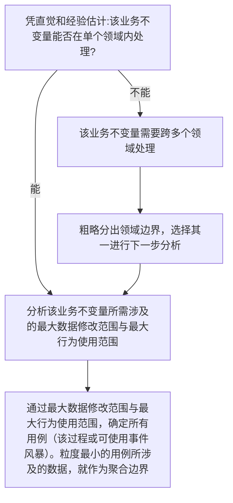

# 面向演化的 DDD × 组件化开发指导文档

> **目的**：
> 本文档不是 DDD 教程，也不是原则清单，而是一份**用于真实项目验证的开发指导文档**。
> 它总结了一种以“抗需求演化”为核心目标的 DDD 落地方式，融合了：
>
> * DDD 的一致性与业务不变量思想
> * 组件化 / 角色化设计
> * Use Case 驱动的模型组装方式

---

## 一、核心设计目标

本指导文档以以下原则为**唯一最高目标**：

> **当需求发生变化时，修改是否能被局部化，并且以“新增”为主，而非修改既有稳定代码。**

所有设计取舍，都围绕这一点展开。

---

## 二、术语说明

* **业务不变量**：由需求得到的“必须始终成立的业务规则”，举例：
  * 订单总价 = 各项明细之和
  * 用户名全局唯一
  * 库存不能为负数
  * 每个用户只能有一个默认收货地址
  * 用户支付订单时，实际支付金额要受各种优惠活动影响

* **一致性**：事务对数据一致性的要求，分为两类：
  * 强一致性：事务内部的所有数据必须始终保持一致，单个事务引发的修改必须全部成功或全部失败。
  * 最终一致性：在业务需要多事务协作完成时，整个系统中被修改的数据允许在短时间内不一致，但最终必须达到一致状态。

---

## 三、聚合的设计原则

### 3.1 聚合的唯一存在理由

> **聚合存在的唯一理由，是“在业务流程中，需求设计上具有强一致性的数据必须被定义成聚合，以在代码上仍保证强一致性”；需求设计上不需要强一致性的数据，则必须被拆分成多个聚合，以避免不必要的强一致性约束。**

判断一个字段 / 行为是否应进入同一聚合，只问一个问题：

> **它们是否必须在同一事务中保持一致？**

* 是 → 同一聚合
* 否 → 必须拆分

基于该原则，在进行聚合设计时，应时刻参照3.2与3.3章节的方法与示例。

---
### 3.2 需求设计阶段-识别聚合边界

**步骤1**: 识别业务不变量

该阶段主要通过与业务方讨论，识别出系统中的业务不变量。（大抵是在讲用户故事）

**步骤2**: 判定一致性强度

对所有业务不变量，依次分析如下问题：



**步骤3**: 按以下原则进行验证：

1. 聚合内的所有数据，都必须在同一事务内保持强一致性，没有任何用例会小到只需要修改聚合的一部分数据而不需要修改其他数据。如果有这样的用例，则必须拆分聚合。
2. 在应用层编写业务流程时，因一项业务而需要被加载的所有聚合所包含的数据，必须恰好等同于该业务所需读取和修改的数据，不能多于也不能少于。
---

### 3.3 分析流程示例

以设计用户模块为例，假设有如下业务不变量：

1. 用户名全局唯一，且用户能修改用户名
2. 用户有头像、个性签名、个人简介等信息需要展示
3. 用户能通过手机号、邮箱、用户名三种方式登录
4. 用户有多个收货地址，但只能有一个默认收货地址

**分析过程**：
1. 业务不变量1：用户名全局唯一
   * 该业务不变量应完全由用户领域内处理 → 进入步骤2
   * 最大数据修改范围： 用户名字段 → 该业务不变量所涉及的数据只有用户名字段 → 该业务不变量可作为一个聚合边界
   * 最大行为使用范围： 没有复杂的业务行为
   * 结论：设计出 UserName 聚合，包含字段：UserId, UserName
2. 业务不变量2：用户有头像、个性签名、个人简介
   * 该业务不变量应完全由用户领域内处理 → 进入步骤2
   * 最大数据修改范围： 头像、个性签名、个人简介字段
   * 用例分析：用户可以在一次操作中只修改头像/只修改个性签名/只修改个人简介 → 该业务不变量所涉及的数据需要拆分成多个聚合
   * 最大行为使用范围：没有复杂的业务行为
   * 结论：设计出 UserAvatar, UserSignature, UserBio聚合，分别包含字段：
     * UserAvatar 聚合： UserId, AvatarUrl
     * UserSignature 聚合： UserId, Signature
     * UserBio 聚合： UserId, Bio

以上分析了两个简单的业务不变量，下面分章节的3.4与3.5将分别展示更复杂的业务不变量分析示例。

### 3.4 复杂业务分析示例：全功能的登录体系

**需求描述**：
1. 用户可通过手机号、邮箱、用户名登录
2. 登录失败需记录次数，连续失败5次锁定账号30分钟
3. 记录最后一次登录时间

**分析过程**：
1.  **最大数据修改范围**：需求中需要被修改的数据集中于安全状态管理，包括登录失败计数、锁定状态、最后登录时间等。其他所需的数据（如凭证信息）在登录过程中仅需读取，不涉及修改。
2.  **最大行为使用范围**：登录流程中，涉及的业务行为包括凭证校验规则与锁定规则。

**结论**：
我们将该业务拆解为三个独立的维度：**身份索引**、**凭证校验**、**安全状态**。

#### 1. 身份索引（Identification）
登录的第一步是“根据输入找到 UserId”。这是一个索引查找过程。在写模型侧，对应的聚合是：
*   **UserPhone 聚合**：`{ PhoneNumber (Key), UserId }`
*   **UserEmail 聚合**：`{ EmailAddress (Key), UserId }`
*   **UserName 聚合**：`{ UserName (Key), UserId }`

而读模型侧如何从数据库之类的数据源中高效地找到 UserId，属技术问题，无论是在commandHandler里写SQL/维护投影表/使用GraphQL或Elasticsearch都无关建模问题，不在本文讨论范围内。

#### 2. 凭证校验（Configuration）
找到 UserId 后，需要校验凭证。该需求对应的业务不变量为凭证校验规则。我们设计如下聚合来承载：
*   **UserPassword 聚合**：`{ UserId, PasswordHash, Salt }`

#### 3. 安全状态（Runtime State）
登录失败计数、锁定状态，属于“高频写”的数据。该需求对应的业务不变量为锁定规则。我们设计如下聚合来承载：
*   **UserLoginSecurity 聚合**：`{ UserId, FailureCount, LockoutEndTime, LastLoginTime }`
    *   业务规则方法：`CheckLockout()`, `RecordSuccess()`, `RecordFailure(maxRetry)`

**应用层编排示例**：

```csharp
public void Login(string input, string password)
{
    // 1. 从请求上下文中识别用户 ID
    var userId = IdentifyUserId(input);
    if (userId == null) throw new UserNotFoundException();

    // 2. 为了使用锁定规则这一行为，加载相应聚合
    var securityState = repo.Get<UserLoginSecurity>(userId);
    
    // 3. 检查是否锁定
    if (securityState.IsLocked(DateTime.Now)) 
        throw new AccountLockedException(securityState.LockoutEndTime);

    // 4. 为了使用凭证校验规则这一行为，加载相应聚合
    var credential = repo.Get<UserPassword>(userId);

    // 5. 校验逻辑
    if (credential.Verify(password))
    {
        securityState.RecordSuccess(DateTime.Now); // 重置计数，更新时间
        repo.Save(securityState); // 如果有efcore等orm框架并开启自动变更追踪，则可省略
        // 发放 Token...
    }
    else
    {
        securityState.RecordFailure(DateTime.Now); // 增加计数，可能触发锁定
        repo.Save(securityState); 
        throw new PasswordMismatchException();
    }
}
```

### 3.5 集合类业务分析示例：默认收货地址

**需求描述**：用户有多个收货地址，但始终只能有一个默认地址。

**分析过程**：
1.  **最大数据修改范围**：修改地址详情和切换默认地址，二者互不影响。
2.  **最大行为使用范围**：没有复杂的业务行为。

**结论**：
将“地址内容”与“默认设置”拆分。
*   **Address 聚合**：`{ UserId, AddressId, xxx... }`
    *   负责地址内容的增删改
*   **UserDefaultAddress 聚合**：`{ UserId, DefaultAddressId }`
    *   **唯一职责**：维护“谁是默认”这个指针。

当用户修改地址详情时，只加载 `Address`。
当用户切换默认地址时，只加载 `UserDefaultAddress`。

## 四、应用层的正确职责（防止退化为 MVC）

### 4.1 应用层可以做什么

应用层**被允许且必须**：

* 按用例选择要加载哪些聚合
* 决定使用哪些策略 / 角色
* 编排调用顺序
* 组装用例级视图（View / DTO）

### 4.2 应用层绝不能做什么

* ❌ 定义业务规则
* ❌ if/else 决策业务含义
* ❌ 修改或绕过领域不变量

**判断标准**：

> 应用层代码读起来应当像是用户故事，而不应该像业务规则文档。
> 应用层代码的语义应与业务保持完全一致，业务的处理流程要在应用层中清晰可见，但不包括任何业务规则细节。
> 应用层只能将前端传来的命令作为唯一的上下文，并根据该上下文进行业务编排，不允许在编写代码时读取任何领域状态来做编排决策。

### 4.3 应用层决策的边界示例

**✅ 允许的决策** (基于用例上下文):
```csharp
// 根据操作来源选择策略
var policy = request.Source == "Admin" 
    ? new AdminNamePolicy() 
    : new UserNamePolicy();
user.ChangeName(newName, policy);
```

**❌ 禁止的决策** (基于领域状态):
```csharp
// 这是领域规则,不应在应用层
if (user.VipLevel > 3)
{
    // 错误!这是领域知识
}
```
---

## 五、领域模型的“组件化”落地方式

### 5.1 从“胖对象”转向“组合”

不再追求：

```text
一个聚合 = 所有状态 + 所有行为
```

而是：

```text
稳定状态 + 可组合组件 / 策略
```

从大聚合到小聚合的的设计理由是：实际业务中，每一个用户故事往往只涉及少量状态，而大部分状态在该用户故事中并不需要被读取或修改。因此，我们将聚合设计为与每一个用户故事的需求完全匹配的单元，以便在应用层按需加载和组合。

将状态与行为分开定义的设计理由是：在做面向对象设计时，对象的状态比行为更容易率先被确定并保持稳定，而行为往往会随着需求变化而变化。因此，我们选择将“稳定状态”与“可变行为”分离，通过组合不同的行为组件或行为策略来实现行为的变化。

---

### 5.2 组件化的行为

当同一状态需要“完全不同的一套行为”时，采用如下设计方式：

* 不要塞进同一个类
* 不要用 if/else

使用组件对象：

```text
State + ComponentA
State + ComponentB
```

示例：

* 需求是编辑 XML 文档：通过文本编辑组件，可以把xml作为文本编辑/通过树编辑组件，可以把xml作为树编辑
* 需求是计算价格：通过不同的定价策略组件，实现不同的价格计算方式，然后供应用层按需组合使用
* 需求是统计用户在各个业务模块的行为痕迹，比如点赞数量，支付金额，登录情况，停留时长：不对现存的代码做修改，而是新增不同的统计组件，供应用层按需组合使用
---

## 六、领域事件的正确使用方式

如果系统中使用分布式事务，必须使用流程编排（Orchestration），而不是流程编舞（Choreography），以确保应用层能显式记录流程状态，保持业务与代码在语义上的一致。

## 七、数据加载与持久化原则

### 7.1 数据为用例服务，而非模型服务

* 不追求“一次加载完整对象”
* 允许不同用例加载不同数据形态

---

### 7.2 整存整取不是原则

* 如果没有强一致性需求
* 就没有理由整存整取

---

### 7.3 性能问题

如果认为“频繁加载小聚合”会带来性能问题，请检查当前项目的数据库表有多少个字段，如果一个表就有几十个字段，且数据类型复杂，那么请先狠狠斥责自己一顿。仓储层和基建层的糟糕设计请由仓储层和基建层负责，而不能成为指责领域层和应用层设计的理由。

---

### 7.4 需求变更抗性

考虑如下场景：近一个月以来，因需求的变化，某个用例需要新增读取某个字段A，另一个用例需要删去读取某个字段B。在以往的情况下，为了实现这些需求变更，从领域层的聚合定义开始，代码变动一路向上传导到应用层，一路向下传导到数据库表定义，仅仅为了一个字段的增删，往往需要修改几十处代码。而在本文档所倡导的设计方式下，情况变成了以下几种：

1. 新增的字段A原先不存在于系统中：按需求分析新增相应聚合，或仅对某个极小的聚合新增字段A。数据库新建相应表，或仅对某个极小的表新增字段A。应用层新增加载该聚合或使用该字段A的代码。整个过程仅涉及极少数代码修改，且大部分修改都是新增代码。
2. 新增的字段A原先已存在于系统中：应用层仅需新增加载该字段A所在聚合的代码，领域层和数据库层无需任何修改。

## 八、判断设计是否优秀的四个自检问题

在每次需求评审或重构时，逐条回答：

1. 新需求是否主要通过“新增代码”完成？是否避免修改既有稳定聚合？
2. 此次重构影响的业务不变量有哪些？这些业务不变量是否被合理地局部化到了各个聚合中？
3. 应用层是否只做选择与编排？业务需求是否与应用层代码语义一致？应用层代码中是否没有任何业务规则细节？
4. 处理业务时是否只加载了必要的聚合？被加载的聚合所包含的状态是否与业务所需读写的状态一致，不多不少？

---

## 九、常见反模式（必须明确避免）

* 聚合 = 数据表映射
* 聚合根 = 领域全知对象
* Service 中堆砌业务规则
* 为了 ORM 方便而设计模型
* 用“DDD 原则”替代设计判断

---